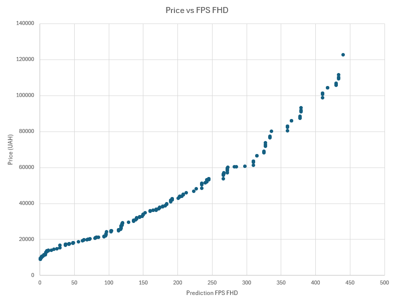
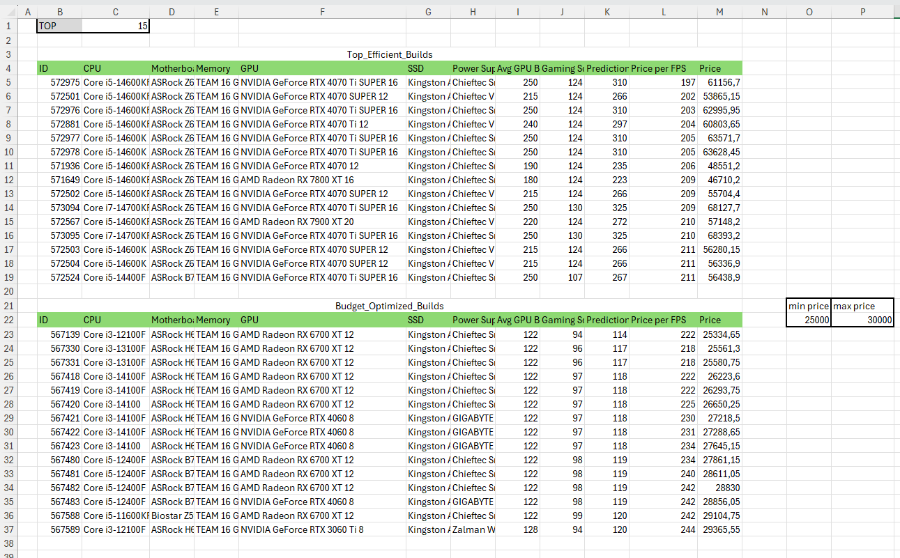
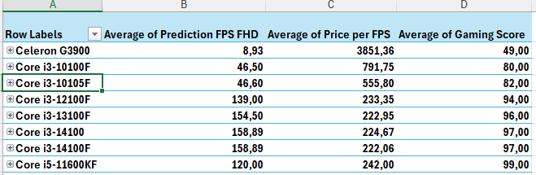
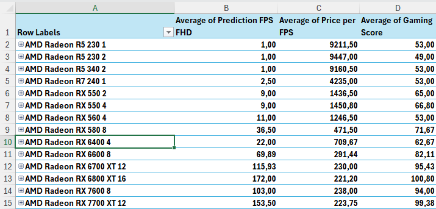
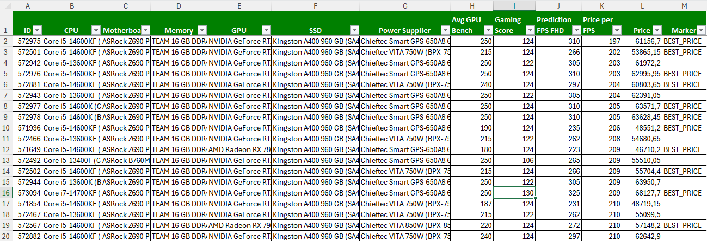

# PC Analyzer


**PC Analyzer** is a data collection and analysis tool for the Ukrainian PC components market. It aggregates current prices from [Hotline](https://hotline.ua) and performance benchmarks from [UserBenchmark](https://userbenchmark.com), computes cost-per-frame efficiency (₴/FPS) across thousands of compatible build combinations, and outputs a structured Excel dataset ready for analysis.

---

## Table of Contents

- [Key Findings](#key-findings)
- [What You Can Analyse](#what-you-can-analyse)
- [Analytical Work & Visualizations](#analytical-work--visualizations)
- [Dataset Structure](#dataset-structure)
- [Data Sources & Collection](#data-sources--collection)
- [Compatibility Logic & Calculations](#compatibility-logic--calculations)
- [Key Features](#key-features)
- [Tech Stack](#tech-stack)
- [Current Status](#current-status)
- [Setup](#setup)
- [API & Web Interface](#api--web-interface)
- [Author](#author)

---

## Key Findings

> These insights are derived from the last successful dataset collected from the Ukrainian market.

- **The ₴45k–₴65k range delivers the best ₴/FPS ratio in the dataset.** The top 10 most efficient builds all fall within this bracket, achieving 197–209 ₴/FPS. Budget builds in the ₴25k–₴30k range cost 218–234 ₴/FPS — roughly 10–15% worse efficiency, and with significantly lower FPS ceilings (114–119 FPS vs 235–310 FPS).

- **The dominant build combination is Intel Core i5-14600KF + NVIDIA RTX 4070 Ti SUPER**, appearing in 4 of the top 10 most efficient configurations. This pairing delivers up to 310 predicted FPS at ₴197/frame — the best single result in the dataset. The i5-14600KF alone appears in 9 out of 10 top builds, paired consistently with the ASRock Z690 Phantom Gaming 4 and 16 GB DDR4.

- **Intel dominates AMD across all price segments on ₴/FPS.** The Core i5-14400F achieves the lowest ₴/FPS in the entire CPU dataset (₴215/frame), and the i5-14600KF leads the high-mid segment at ₴215.50/frame. AMD's best result — Ryzen 5 5500 at ₴255/FPS — is 18% worse than its Intel equivalent. No AMD CPU in the dataset breaks the ₴250/FPS barrier.

- **Nvidia's RTX 4070 family leads GPU efficiency**, with the RTX 4070 Ti at ₴212/FPS being the most efficient GPU overall. The advantage comes from high benchmark scores that distribute cost across more frames. AMD's RX 7900 XT (₴215.75/FPS) is the closest competitor. In the budget segment (₴25k–₴30k), AMD's RX 6700 XT (₴230/FPS) beats the RTX 4060 (₴234/FPS) — making AMD the better value at entry level.

- **CPU bottleneck is visible at the high end.** The i9-14900KS delivers the highest average FPS (440) but at ₴278/FPS — 29% worse efficiency than the i5-14600KF. A Gaming Score of ~124 (i5-14600KF) is sufficient to fully utilize GPUs up to the RTX 4070 Ti SUPER without bottlenecking, making higher-tier CPUs hard to justify on value grounds.

---

## What You Can Analyse

The generated dataset enables a range of analytical tasks out of the box:

- **Price-to-performance ranking** — sort all builds by ₴/FPS to instantly identify the most efficient configurations at any budget level.
- **Budget segmentation** — filter builds by total cost to compare what you get at ₴20k, ₴30k, ₴50k, and above.
- **Bottleneck detection** — compare the CPU Gaming Score against the GPU Avg Bench across builds to identify which component limits performance in each price tier.
- **Component contribution analysis** — isolate the impact of individual CPUs or GPUs on overall build efficiency across hundreds of combinations.
- **Brand & platform comparison** — compare Intel vs AMD CPUs and Nvidia vs AMD GPUs on both performance and value using real market prices.
- **Market availability signal** — offer count per component reflects real-world availability and pricing reliability.

---

## Analytical Work & Visualizations

### Price vs FPS — Scatter Plot

The chart below shows cost-performance efficiency for all Pareto-optimal (`BEST_PRICE`) builds.



> As FPS increases, total price rises proportionally — confirming a positive correlation between cost and performance. In the lower price range, each additional hryvnia yields a noticeable FPS boost. Beyond a certain threshold the curve flattens: extra spending no longer produces proportional gains, a classic diminishing returns effect. The optimal ₴/FPS zone — where `BEST_PRICE` builds cluster — sits in the middle of the curve before the plateau begins.

---

### Top Efficient Builds & Budget-Optimized Builds



> All top 10 most efficient builds share a common CPU: **Intel Core i5-14600KF** (9 out of 10 builds), paired with the ASRock Z690 Phantom Gaming 4 motherboard and 16 GB DDR4 RAM. This combination consistently delivers a Gaming Score of 124 — the sweet spot for avoiding CPU bottleneck across mid-to-high-range GPUs.
>
> On the GPU side, the dominant card is the **RTX 4070 Ti SUPER** (4 builds), followed by the RTX 4070 Ti, RTX 4070 SUPER, and RTX 4070. Notably, one AMD card — the **RX 7800 XT** — made the top 10 (rank 8), offering 223 predicted FPS at ₴46,710 — the lowest total price in the top 10. Build prices range from ₴46,710 to ₴68,127, with ₴/FPS between 197 and 209. The single most efficient build (#572975) delivers **310 FPS at ₴197/frame**.
>
> In the **budget segment (₴25k–₴30k)**, all top builds use Intel Core i3 processors (12100F, 13100F, 14100F) with the ASRock H610M-H2/M.2. The dominant GPU is the **AMD Radeon RX 6700 XT 12GB** (7 out of 10 builds), consistently outperforming the RTX 4060 at this price range: ~218–225 vs 230–234 ₴/FPS. All budget builds deliver approximately 114–119 predicted FPS at Full HD. The most efficient budget build (#567139, i3-12100F + RX 6700 XT) achieves **222 ₴/FPS at ₴25,334** — proof that AMD GPUs dominate value at entry level.

---

### CPU Performance PivotTable

Aggregated statistics comparing CPUs by average FPS, price per FPS, and Gaming Score.



> The Intel Core i5 series shows the best price-to-performance ratio across the board. The **Core i5-14600KF** has the lowest ₴/FPS (₴215.50) among all CPUs with a Gaming Score above 120, delivering an average of 289 FPS. In the mid-range segment (Gaming Score 106–114), the **Core i5-14400F** leads at ₴215/FPS — the single lowest value in the entire dataset. No AMD CPU comes close: the Ryzen 5 5500 (₴255/FPS) and Ryzen 3 series (₴780–₴867/FPS) lag significantly behind their Intel counterparts. High-end CPUs (i7/i9) deliver more raw FPS but at a worse ₴/FPS ratio — the i9-14900KS costs ₴278/FPS despite being the fastest CPU tested, making it 29% less efficient than the i5-14600KF.

---

### GPU Performance PivotTable

Aggregated statistics comparing GPUs by average FPS, price per FPS, and Gaming Score.



> The **NVIDIA RTX 4070 Ti** leads the entire dataset at ₴212/FPS, followed by the RTX 4070 Ti SUPER (₴213.14) and RTX 4070 SUPER (₴213.57). The efficiency advantage comes from high benchmark scores (Avg GPU Bench 215–250) that distribute cost across more frames — not from a lower price tag. AMD's **RX 7900 XT** (₴215.75/FPS) is the strongest AMD competitor overall. However, in the ₴25k–₴30k budget segment, AMD's **RX 6700 XT** (₴230/FPS) clearly outperforms the RTX 4060 (₴234/FPS), confirming AMD's value advantage at entry level. The premium tier shows clear diminishing returns: the RTX 4080 (₴234/FPS) and RTX 5080 (₴250/FPS) are significantly less efficient despite higher raw FPS.

---

### Excel Automation & Analytical Features

The Excel report includes built-in analytical tooling without requiring external BI tools:

- **Best Price Table** — automatically filters Pareto-optimal builds using a custom formula (`CHOOSECOLS + FILTER + HSTACK`).
- **Price Range Filters** — helper tables to quickly segment builds by budget tiers.
- **Formatting** — frozen headers, auto-filters, conditional formatting, and color coding: green headers, alternating rows, best builds highlighted in light blue.

Sample dataset: [`pc_configuration 2025-02-09 11-53.xlsx`](src/main/resources/files/pc_configuration%202025-02-09%2011-53.xlsx)



---

## Dataset Structure

Each row represents one fully compatible PC build. Columns:

| Column | Description |
|--------|-------------|
| **Part Number** | Unique build identifier |
| **CPU** | Processor name + Hotline link |
| **Motherboard** | Motherboard name + link |
| **Memory** | RAM name + link |
| **GPU** | Graphics card name + link |
| **SSD** | SSD name + link |
| **PSU** | Power supply unit name + link |
| **Price** | Total build cost (₴) |
| **Prediction FPS** | Predicted FPS at Full HD |
| **Gaming Score** | CPU gaming benchmark (from UserBenchmark) |
| **Avg GPU Bench** | GPU performance rating (from UserBenchmark) |
| **Price per FPS** | Cost per frame (₴/frame) — key efficiency metric |
| **Marker** | `BEST_PRICE` for Pareto-optimal builds |

---

## Data Sources & Collection

### Hotline — Ukrainian Market Prices

Six component categories parsed via Jsoup (multithreaded, with retry on errors):

| Category | Data Collected |
|----------|----------------|
| **CPU** | Model, URL, prices, average price, socket, frequency, L3 cache, cores/threads, package type, offer count |
| **GPU** | Name, URL, manufacturer, memory type/size, bus, PCIe port, prices, offer count |
| **Motherboard** | Name, URL, socket, chipset, memory type, form factor, prices, offer count |
| **RAM** | Name, URL, DDR type, capacity, frequency (MHz), prices, offer count |
| **SSD** | Name, URL, type, capacity, read/write speed, prices, offer count |
| **PSU** | Name, URL, wattage, standard, MB/GPU connectors, prices, offer count |

Price range `"12 345 грн – 15 678 грн"` is reduced to a single conservative estimate:

```java
avgPrice = Math.min((min + max) / 2, min * 1.15);
```

### UserBenchmark — Performance Benchmarks

Parsed via Selenium WebDriver (Chrome) to bypass bot protection; HTML then processed with Jsoup.

- **CPU:** `gamingScore`, `desktopScore`, `workstationScore`, core/thread count. Uses 3 CSS selector fallbacks for layout changes.
- **GPU:** model, rating, average benchmark. `PowerRequirement` is entered manually via the web interface.

### Name Normalization

Models are normalized before matching across sources:

- `"RTX 4070-Ti"` → `"RTX 4070 Ti"`
- `"Core i7-13700KF"` → `"Core i7-13700K"`

Matching runs longest-to-shortest to avoid false partial matches.

---

## Compatibility Logic & Calculations

### Build Assembly

1. **Filtering:** only components with >5 offers on Hotline (availability signal) and existing benchmark data are included.

2. **Compatibility rules:**
   - **CPU ↔ MB:** socket match + chipset logic:
      - Intel **K**-series → **Z**-chipset
      - AMD **X**-series → **X**-chipset
      - i5/i7/i9 or Ryzen 5/7/9 (non-K/X) → **B**-chipset
      - Others → any chipset
   - **MB ↔ RAM:** DDR4/DDR5 type must match
   - **GPU ↔ PSU:** cheapest PSU with wattage ≥ GPU power requirement

3. **Calculations:**
   ```
   totalPrice          = CPU + cooling + case + MB + RAM + GPU + SSD + PSU
   predictionGpuFpsFhd = gamingScore * avgGpuBench / 100
   priceForFps         = totalPrice / predictionGpuFpsFhd
   ```

4. **Pruning:** builds dominated by another build (lower FPS, higher price) are removed.

5. **Marking:** Pareto-optimal builds are labeled `BEST_PRICE`.

---

## Key Features

- Multithreaded parsing of 6 component categories from Hotline via Jsoup.
- Benchmark parsing from UserBenchmark via Selenium WebDriver (Chrome).
- Conservative price estimation to avoid outlier inflation.
- Automatic name normalization and cross-source matching.
- Component compatibility checking across socket, chipset, memory type, and PSU wattage.
- Non-competitive build pruning and `BEST_PRICE` marking.
- Excel report generation with formatting, auto-filters, and color coding.
- Web interface for data management, log viewing, and report download.

---

## Tech Stack

| Category | Technologies |
|----------|--------------|
| **Backend** | Java 17, Spring Boot 3.4.1 (MVC, Data JPA, WebSocket), Flyway, MapStruct, Lombok |
| **Data Parsing** | Jsoup (multithreaded HTML), Selenium WebDriver (Chrome) |
| **Reporting** | Apache POI (Excel generation) |
| **Database** | MySQL |
| **Frontend** | Thymeleaf (SSR), HTML, WebSocket |
| **Infrastructure** | Maven, Docker, Checkstyle, JUnit |

---

## Current Status

The scraping pipeline is currently blocked by updated bot protection on Hotline.ua. The dataset from the last successful run is available in the repository and serves as the basis for all analytical work.

Analytical work on the existing dataset is in progress.

---

## Setup

### Option 1: Maven + Local MySQL

```bash
git clone https://github.com/ArtemMakovskyy/pc_analyzer.git
cd pc_analyzer
# Configure MySQL in application.properties
mvn spring-boot:run
```

### Option 2: Docker

```bash
git clone https://github.com/ArtemMakovskyy/pc_analyzer.git
cd pc_analyzer
mvn clean package
docker-compose up -d
# Stop: docker-compose down
```

Available at: **http://localhost:8079/**

> **Note:** when deploying to the internet, replace `localhost:8079` with the public address in `src/main/resources/templates/operations.html`.

---

## API & Web Interface

| Method | Endpoint | Description |
|--------|----------|-------------|
| `GET` | `/gpus` | List of graphics cards |
| `POST` | `/saveGpus` | Update GPU power requirements |
| `GET` | `/description` | Description page |
| `POST` | `/operations/execute` | Execute operations (data update, build assembly) |

---

## Author

**Artem Makovskyy**

- Email: artem.makovskyi.jv@gmail.com
- [LinkedIn](https://www.linkedin.com/in/artem-makovskyi-557783304/)
- [GitHub](https://github.com/ArtemMakovskyy)
